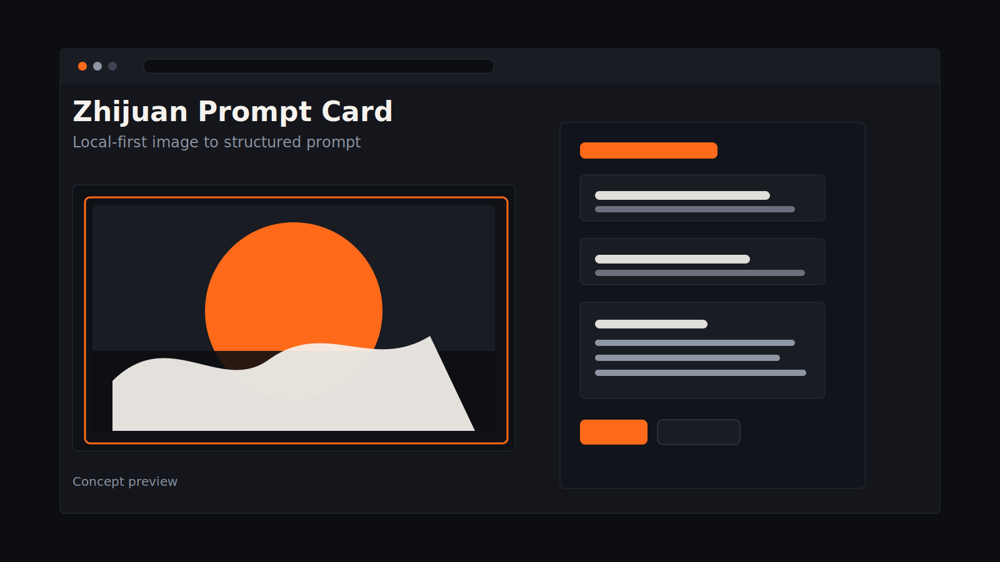
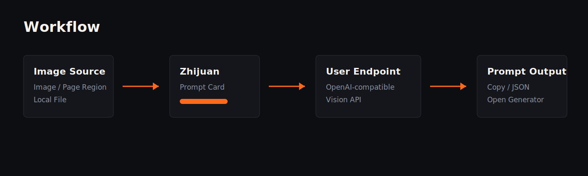
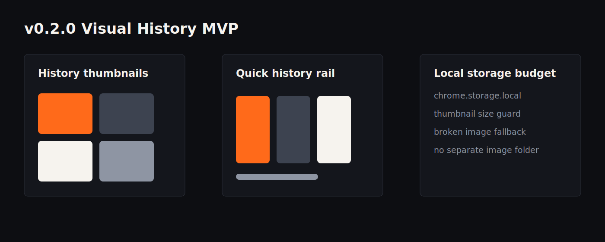
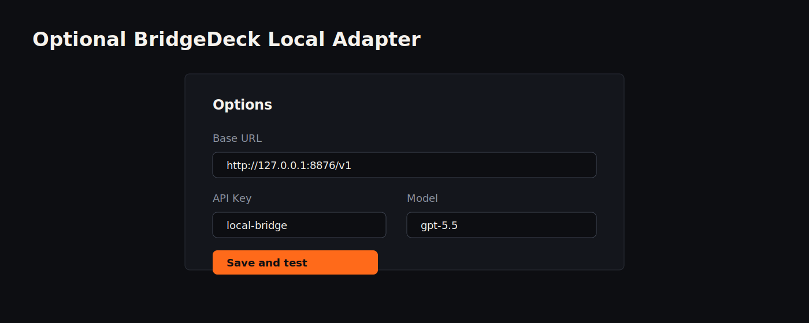
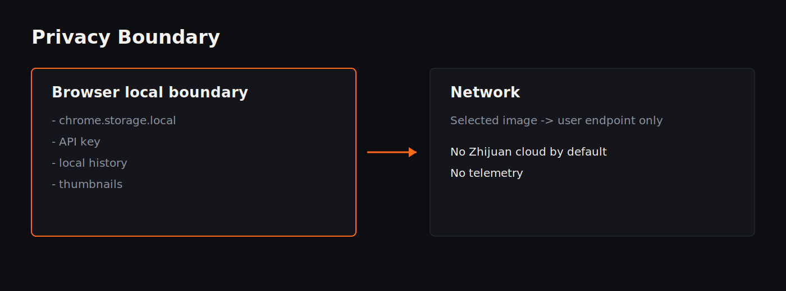
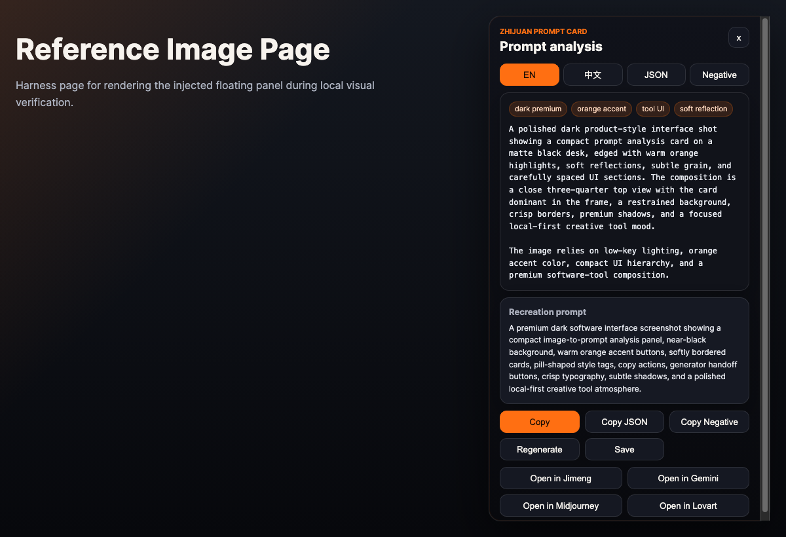
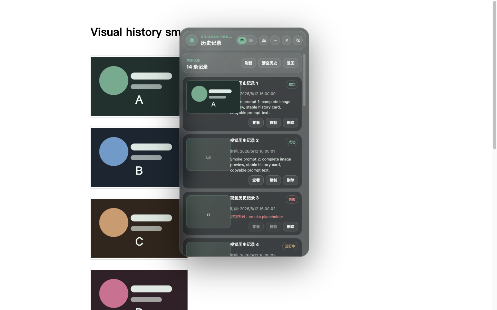
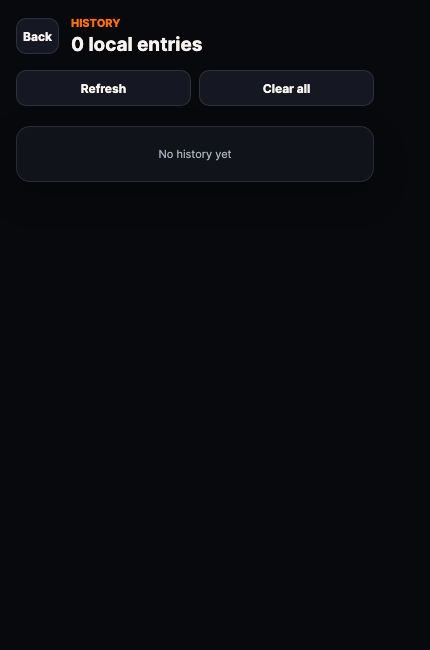
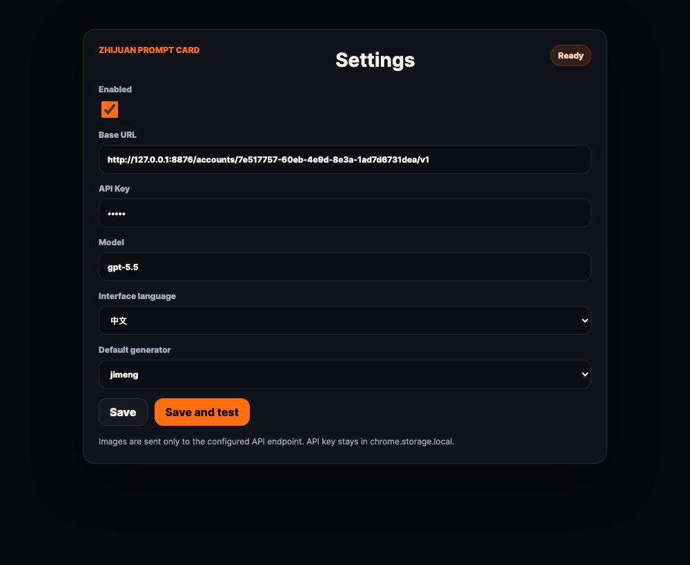
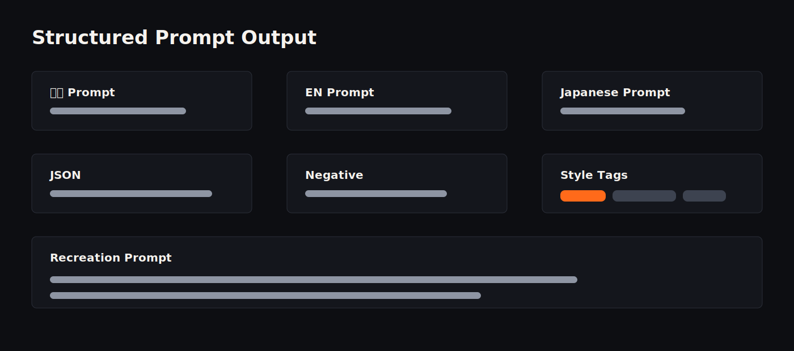

# Zhijuan Prompt Card




Local-first image-to-prompt Chrome extension for designers, photographers, AI artists, and visual creators.

把网页图片、框选区域、本地图片转换成可复用的结构化提示词。

Zhijuan Prompt Card helps visual creators reverse-engineer useful prompts from visual references. It is not a cloud AI platform. It is a focused browser extension that lets users choose an image, send it to their own OpenAI-compatible vision endpoint, and turn the result into structured prompt language.

## What It Does

- Right-click any image.
- Pick an image from a webpage.
- Capture a page region.
- Upload a local image.
- Send the selected image to your configured OpenAI-compatible vision endpoint.
- Generate structured prompts:
  - Chinese prompt
  - English prompt
  - Japanese prompt
  - JSON prompt
  - Negative prompt
  - Style tags
  - Recreation prompt

## Workflow



```text
Image / Page Region / Local File
-> Zhijuan Prompt Card
-> User-configured OpenAI-compatible Vision Endpoint
-> Structured Prompt Output
-> Copy / Open in Generator
```

## Features

- Manifest V3 Chrome extension.
- Popup command surface.
- Right-click image analysis.
- Webpage image picker.
- Screenshot region capture.
- Local image upload.
- Floating prompt panel.
- Chinese / English / Japanese prompt output.
- JSON prompt.
- Negative prompt.
- Style tags.
- Recreation prompt.
- Visual history.
- Local thumbnails.
- Quick history rail.
- Popup visual history grid.
- Local history in `chrome.storage.local`.
- Copy prompt / JSON / negative prompt.
- Open prompts in ChatGPT, Gemini, Midjourney, Jimeng, Lovart, Codex.
- Options page for Base URL, API Key, Model, default generator, and language.
- No bundled cloud by default.

## Visual History MVP



v0.2.0 adds visual history:

- local thumbnail preview
- compact quick history rail in the floating panel
- visual grid in the popup history page
- local storage budget protection
- broken image fallback
- no separate image folder

缩略图保存在 `chrome.storage.local`。本地图片不会另存成文件夹。图片不会发给 Zhijuan 服务器。

## Quick Start

```bash
npm install
npm run typecheck
npm run build
```

Chrome:

1. Open `chrome://extensions`.
2. Enable Developer Mode.
3. Click Load unpacked.
4. Select `dist/`.
5. Open extension options.
6. Configure endpoint, key, and model.

Edge:

1. Open `edge://extensions`.
2. Enable Developer Mode.
3. Load `dist/`.

## Configuration

The extension calls an OpenAI-compatible Chat Completions endpoint.

```text
POST {BASE_URL}/chat/completions
```

The endpoint must support:

- `image_url` input with data URL
- vision understanding
- text response containing JSON that matches the expected schema

Fields:

- Base URL: your endpoint base URL.
- API Key: your endpoint API key. Stored locally in `chrome.storage.local`.
- Model: your vision-capable model name.

## Recommended Setup: BridgeDeck



BridgeDeck is an optional local OpenAI-compatible bridge adapter maintained separately. It is not bundled with Zhijuan Prompt Card and is not required.

The maintainer currently uses BridgeDeck with a `gpt-5.5` model alias because it gives the most accurate prompt reconstruction in the current workflow.

Example local configuration:

```text
Base URL:
http://127.0.0.1:8876/v1

API Key:
local-bridge

Model:
gpt-5.5
```

`gpt-5.5` is a BridgeDeck model alias in the maintainer workflow. Users can use any compatible multimodal vision model. The extension does not include model access, API credits, or a Zhijuan forwarding server by default.

## Model Compatibility

Model compatibility depends on whether your endpoint supports OpenAI-compatible chat completions with vision input.

Currently maintainer-tested:

| Adapter | Model | Status | Notes |
|---|---|---|---|
| BridgeDeck | gpt-5.5 | Recommended | Best reconstruction quality in the maintainer workflow |

Community-tested models are tracked in [docs/MODELS.md](docs/MODELS.md).

## Privacy



- No login.
- No credits.
- No telemetry.
- No analytics.
- No bundled Zhijuan cloud.
- The extension does not operate a server.
- Selected images are sent only to the endpoint configured by the user.
- API keys are stored in `chrome.storage.local`.
- Prompt history is stored in `chrome.storage.local`.
- Visual thumbnails are stored in `chrome.storage.local`.
- Local image files are not copied into a separate folder.

## Screenshots

Product screenshots:

| Floating panel | Content history | Popup visual history | Options page |
|---|---|---|---|
|  |  |  |  |

More capture notes are in [docs/SCREENSHOTS.md](docs/SCREENSHOTS.md).

## Prompt Output



The output is designed for copy/paste and for handoff to generators. It keeps language variants, JSON structure, negative prompt, style tags, and a long recreation prompt together.

## Why Open Source?

- transparent privacy boundary
- community model compatibility reports
- prompt schema improvement
- browser compatibility fixes
- safer local-first workflow
- easier trust review

## Roadmap

Short-term:

- Better onboarding.
- Real screenshot gallery.
- Export history.
- Import/export settings.
- More generator presets.
- More model compatibility notes.
- Better prompt schema tests.
- Better visual history smoke coverage.

Future optional products:

- Optional hosted cloud recognition endpoint.
- Web version.
- macOS app integration.
- Team workflow.
- Prompt template marketplace.

The open-source extension core should remain usable without official cloud services.

## Contributing

See [CONTRIBUTING.md](CONTRIBUTING.md).

Maintenance principles:

- small PRs preferred
- issue first for large changes
- no telemetry
- no forced cloud dependency
- no hardcoded private endpoints
- no paywall inside open-source core
- network behavior must be documented

## License

Apache-2.0.

The code is licensed under Apache-2.0. The name "Zhijuan Prompt", logos, and official cloud service branding are not licensed for commercial reuse without prior permission.
