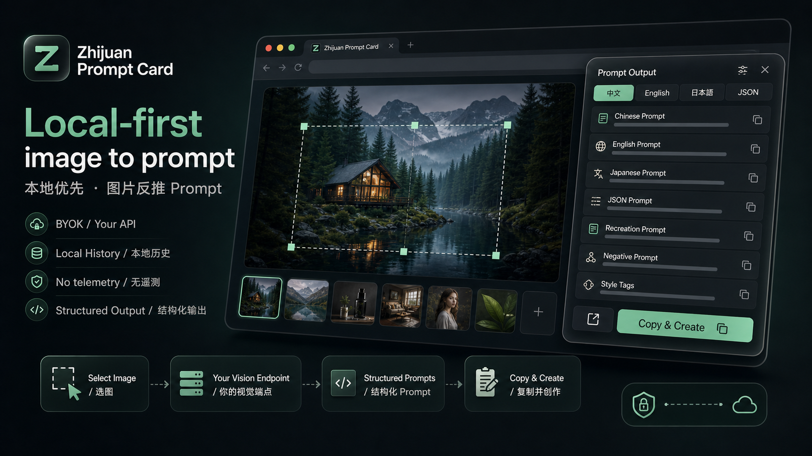
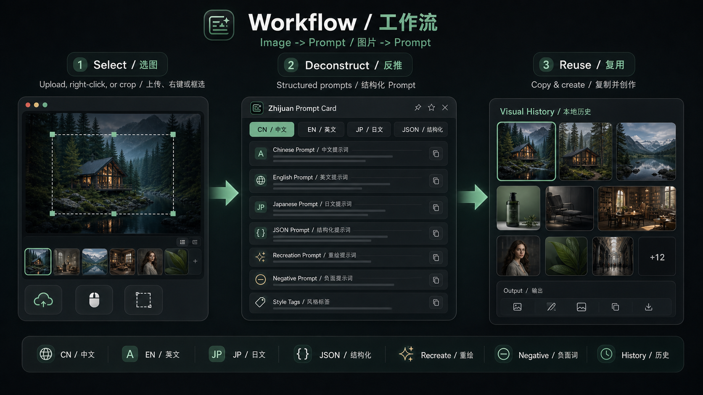
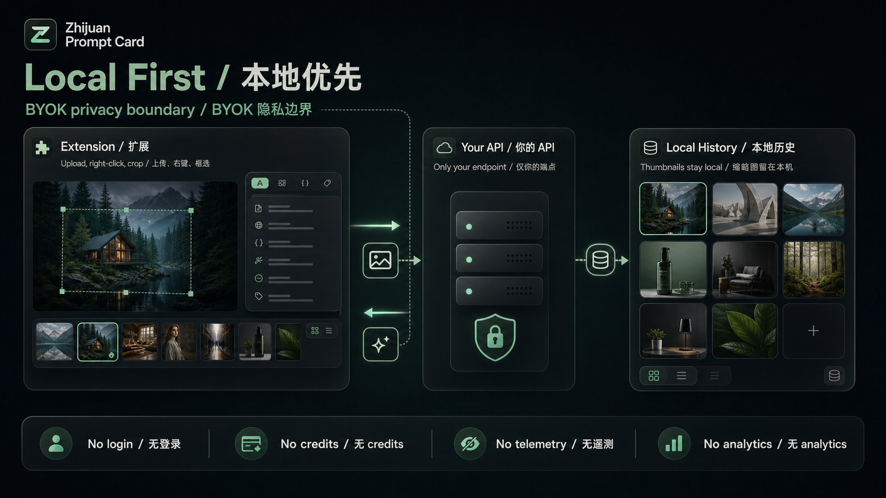

# Zhijuan Prompt Card

**English** | [简体中文](README.zh-CN.md)


Local-first Chrome extension that turns images, screenshots, and page regions into generator-ready prompts through your own OpenAI-compatible vision endpoint.



## Why Use It

Most image-to-prompt tools mix analysis text, model metadata, and generator instructions into the same output. Zhijuan Prompt Card is focused on the handoff: select a visual reference, extract the useful reconstruction language, then copy or open a clean prompt in the generator you already use.

The extension does not ship a hosted Zhijuan AI service. You bring your own compatible endpoint, key, and model.

## Highlights

- Pick images from a page, right-click image elements, capture a page region, or upload a local file.
- Generate Chinese prompts, English prompts, generator-facing JSON prompts, negative prompts, and style tags.
- Preserve visible text, layout hierarchy, subject anchors, camera cues, material behavior, and source-fidelity constraints when the model can infer them from the image.
- Keep a local visual history with thumbnails and copyable prompt outputs.
- Open prompts in ChatGPT, Gemini, Midjourney, Jimeng, Lovart, Codex, or a custom generator URL.
- Store configuration and history locally in Chrome storage.
- Use your own OpenAI-compatible Chat Completions vision endpoint.

## Workflow



```text
Image / Page Region / Local File
-> Zhijuan Prompt Card
-> Your OpenAI-compatible Vision Endpoint
-> Structured Prompt Output
-> Copy / Open in Generator
```

## Generator Output

Zhijuan Prompt Card separates copy-ready prompt text from internal structured data.

| Output | Purpose |
|---|---|
| English | Primary recreation prompt for external image generators |
| Chinese | Chinese-language prompt for review, editing, and Chinese workflows |
| JSON | Generator-facing JSON prompt that starts with a `prompt` field |
| Negative | Drift blockers and quality constraints |
| Tags | Compact style and material descriptors |

Since v0.3.3, normal copy, history copy, and Open in generator use a generator-safe prompt. Internal schema metadata such as `schema_version: "reconstruction_v2"` stays in structured exports and no longer becomes default generator text unless it is genuinely visible in the source image.

## Install

### From GitHub Release

The Chrome Web Store and Edge Add-ons builds are not published yet. Use the release zip for normal testing.

1. Download the latest `zhijuan-prompt-card-<version>.zip` from [Releases](https://github.com/papperrollinggery/zhijuan-prompt-card/releases/latest).
2. Unzip the archive.
3. Open `chrome://extensions` or `edge://extensions`.
4. Enable Developer Mode.
5. Click **Load unpacked**.
6. Select the unzipped folder that contains `manifest.json`.
7. Open the extension options and configure your endpoint, API key, and model.

### From Source

Requirements:

- Node.js 20+
- npm 10+
- Chrome 120+ or recent Microsoft Edge
- An OpenAI-compatible vision endpoint

```bash
npm ci
npm run typecheck
npm run build
```

Then load the generated `dist/` folder as an unpacked extension.

## Configure

Open the extension options page and set:

| Field | Meaning |
|---|---|
| Base URL | OpenAI-compatible API base URL, for example `http://127.0.0.1:3777/v1` |
| API Key | Your provider or local adapter key |
| Model | A vision-capable chat model |
| Default Generator | The external generator opened by the handoff button |
| Language | Default UI/output language preference |

### Recommended Setup: BridgeDeck

[BridgeDeck](https://github.com/papperrollinggery/bridgedeck) is an optional local OpenAI-compatible bridge adapter maintained separately. It is useful when you want Zhijuan Prompt Card to call a local bridge endpoint instead of wiring every model provider directly into the extension.

BridgeDeck can expose a `/v1` API shape that the extension can use as its vision endpoint while the extension itself stays local-first and provider-neutral. BridgeDeck is not bundled with Zhijuan Prompt Card and is not required.

Example local configuration:

```text
Base URL:
http://127.0.0.1:8876/v1

API Key:
local-bridge

Model:
gpt-5.5
```

If BridgeDeck is not running locally, replace these values with your own compatible vision endpoint. `gpt-5.5` is a BridgeDeck model alias in the maintainer workflow. Users can use any compatible multimodal vision model. The extension does not include model access, API credits, or a Zhijuan forwarding server by default.

See [Model Compatibility](docs/MODELS.md) for tested adapters and reporting guidance.

## Privacy Model



- No bundled Zhijuan cloud endpoint.
- No hidden telemetry.
- API keys stay in Chrome extension storage.
- Prompt history and thumbnails stay in `chrome.storage.local`.
- Images are sent only to the endpoint you configure.
- Release builds are distributed as source-buildable extension packages.

See [PRIVACY.md](PRIVACY.md), [SECURITY.md](SECURITY.md), and [THIRD_PARTY_NOTICES.md](THIRD_PARTY_NOTICES.md) for the full public policy surface.

## Documentation

| Need | Link |
|---|---|
| Release history | [CHANGELOG.md](CHANGELOG.md) |
| Install and release process | [docs/RELEASE.md](docs/RELEASE.md) |
| Model compatibility | [docs/MODELS.md](docs/MODELS.md) |
| Manual installed-extension checks | [docs/installed-extension-acceptance.md](docs/installed-extension-acceptance.md) |
| Screenshots and assets | [docs/SCREENSHOTS.md](docs/SCREENSHOTS.md) |
| Contribution guide | [CONTRIBUTING.md](CONTRIBUTING.md) |
| Code of conduct | [CODE_OF_CONDUCT.md](CODE_OF_CONDUCT.md) |

## Development

Common checks:

```bash
npm run typecheck
npm run build
npm run check:storage
npm run check:json-repair
npm run check:prompt-goal
```

Package a release zip:

```bash
npm run release:package
```

Run the release package check:

```bash
npm run release:check
```

## Project Status

- Latest release: [v0.3.3](https://github.com/papperrollinggery/zhijuan-prompt-card/releases/tag/v0.3.3)
- Distribution: GitHub release zip and source build
- Browser store listings: not published yet
- License: [Apache-2.0](LICENSE)

Release tags are machine-simple, for example `v0.3.3`. Detailed user-facing changes live in [CHANGELOG.md](CHANGELOG.md) and GitHub release notes.

## Contributing

Contributions are welcome for browser compatibility, prompt schema improvements, generator presets, model compatibility notes, documentation, and i18n. Please read [CONTRIBUTING.md](CONTRIBUTING.md) before opening a larger PR.

## License

Apache-2.0. See [LICENSE](LICENSE) and [NOTICE](NOTICE).
